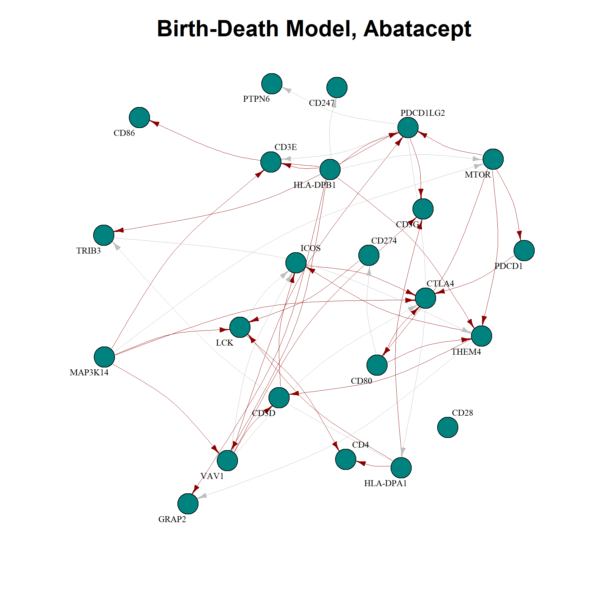

# Folder structure 

The repository accompanying this thesis is structured into three main folders to facilitate reproducibility and organization. 
The [first folder](./Code) contains the implementation of the two MCMC algorithms developed as part of this work: the adaptive MCMC and the Birth-Death MCMC (BDMCMC). 
Alongside the algorithm code, this folder also includes an example demonstrating their usage to guide users in applying the methods to their own data. 
Other two folders dedicated to the [Figures](./Figures) and [Tables](./Tables) that are central to the analysis and results presented in the thesis.  The third component of the repository is the [TEX file](./thesis.tex) of the thesis itself, which can be compiled given the provided folder structure. 

# Content

The thesis delves into the theory and applications of binary directed acyclic graphs (DAGs), with a focus on developing and improving Markov Chain Monte Carlo (MCMC) methods. Starting from the theoretical foundation, I explored the DAG structure and factorization through the lens of structural equation models, specifically leveraging the [work of Castelletti](https://arxiv.org/pdf/2201.12003). Building on the package designed by the professor, I aimed to enhance computational performance by implementing two advanced algorithms: an adaptive MCMC, which adjusts step sizes dynamically to improve sampling efficiency, and a Birth-Death MCMC (BDMCMC) with global moves to better explore the DAG space.

To assess the performance of these algorithms, I employed diagnostic measures, including the Kolmogorov-Smirnov statistic, Rubin’s diagnostic, and the computation of posterior edge probabilities. 

In the practical application, I turned to gene network reconstruction, focusing on the CD28 pathway in patients with early diffuse systemic sclerosis (dcSSc). Drawing from a clinical trial conducted in 2022, which investigated the effects of abatacept versus placebo, I analyzed RNA-seq data and clinical severity scores, such as the modified Rodnan skin score (mRSS). Using the trial's findings, I estimated posterior probabilities of gene interactions. By comparing the network dependencies under abatacept treatment and placebo, I hypothesized that abatacept alters the connectivity of the pathway, potentially increasing specific dependencies as part of its therapeutic mechanism. The final results are displayed below:

This application reflects the broader context of precision medicine, where understanding molecular pathways such as CD28 is crucial for identifying patient subgroups most likely to benefit from targeted therapies. By combining methodological advancements with a real-world biomedical challenge, the thesis bridges computational innovation with clinical insights, contributing to both algorithmic development and the understanding of immune modulation in systemic sclerosis.
